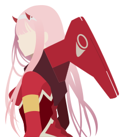
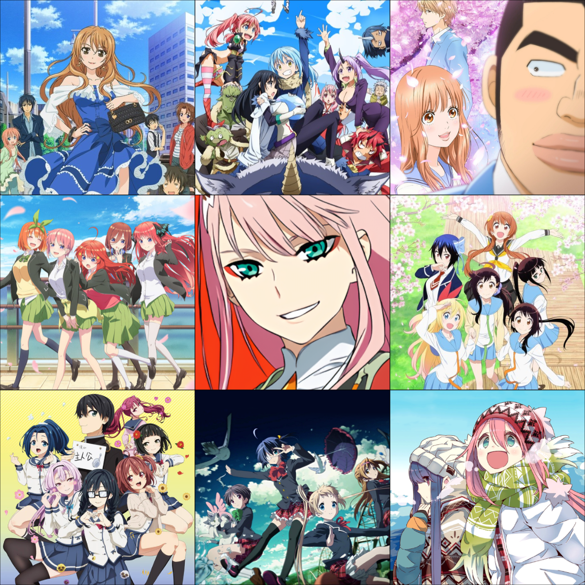

<br/>

```
__________                    ___________                  
\____    /___________  ____   \__    ___/_  _  ______      
  /     // __ \_  __ \/  _ \    |    |  \ \/ \/ /  _ \     
 /     /\  ___/|  | \(  <_> )   |    |   \     (  <_> )    
/_______ \___  >__|   \____/    |____|    \/\_/ \____/     
        \/   \/                                            
__________                 __      ________.__       .__   
\______   \ ____   _______/  |_   /  _____/|__|______|  |  
 |    |  _// __ \ /  ___/\   __\ /   \  ___|  \_  __ \  |  
 |    |   \  ___/ \___ \  |  |   \    \_\  \  ||  | \/  |__
 |______  /\___  >____  > |__|    \______  /__||__|  |____/
        \/     \/     \/                 \/                
```
<details>
  <summary>My 3x3</summary>
  
  
  #TeamNino #TeamOnoderNasaki #TeamHimawari
</details>


---

```typescript

class Alex extends Weeb implements Hacker, Athlete {
  startWorkingDay() {
    while (shouldContinue()) {
      学习中文(); // todo: look into memory leaks....
      const currentProject = this.getCurrentProject();
      continueWorkingOn(currentProject);
      perform(this.getCurrentWorkout());
      endure(getDayJob());
      perform(getWalkingRoute());
      continueWorkingOn(currentProject);
      watch(this.pickAnime());
      question(getCurrentLifeChoices());
      sleep(this.getDesiredHoursOfSleep());
    }
  }
  
  // TODO: Need to find more hobbies.
  startRestDay() {
    eat(findFood());
    watch(this.pickAnime());
    watch(getWalkingRoute())
    watch(this.pickAnime());
    sleep(this.getDesiredHoursOfSleep());
  }

  private favoriteLanguages = ['TypeScript', 'Kotlin'];
  private getCurrentProject(): Project {
    const buggyProjects = getMaintainedOSSProjects()
      .filter(project => project.hasReportedBug());
    if(!!buggyProjects.length) {
      return new BugFixProject(buggyProjects);
    } else if(!this.hasEnoughAnimeGirlThemes()) {
      return new ExasterbateAnimeAddictionProject();
    }
    const chosenLanguage = pickRandom(this.favoriteLanguages);
    return new RandomProject(chosenLanguage, pickRandomTopic(chosenLanguage));
  }

  private hasEnoughAnimeGirlThemes() {
    return isStillWeeb() && getDurationFromLastBuiltTheme()
      .isGreaterThan(Duration.of(30, DAYS));
  }

  private getCurrentWorkout(): Workout {
    switch (getCurrentDay()) {
      case Days.MONDAY: return Workouts.LEGS;
      case Days.TUESDAY: return Workouts.PUSH;
      case Days.WEDNESDAY: return Workouts.PULL;
      case Days.THURSDAY: return Workouts.SHOULDERS;
      case Days.FRIDAY: return Workouts.CARDIO;
      default: return Workouts.RECOVERY;
    }
  }

  private favoriteAnimeGenres =
    new Set(['Romance', 'Slice of Life', 'Isekai', 'Comedy']);
  private pickAnime(): Anime {
    while (true) {
      const nextAnime = pickRandomAnime();
      const genre = nextAnime.genre;
      if (this.favoriteAnimeGenres.has(genre) ||
        (isTrash(nextAnime) && isEcchi(nextAnime))) {
        return nextAnime;
      }
    }
  }

  private getDesiredHoursOfSleep() {
    return isWeekday() ? 7.5 : pickRandomNumberBetween(7, 10);
  }
}


```
